[//]: # (/***************************************************************************************)
[//]: # (*  REFERENCES)
[//]: # ()
[//]: # (*  Title: Make a README )
[//]: # (*  Used for: Making a readme template)
[//]: # (*  Author: Danny Guo)
[//]: # (*  Date:  2024-11-01)
[//]: # (*  Code version: v0.6.13)
[//]: # (*  URL: https://www.makeareadme.com/)
[//]: # (*  Software License: MIT License)

# Gotta-Go

Gotta-Go is a travel-planner application built using the Django web framework that enables users to create
travel plans, invite other users to their plans, and detail their plans with
several features such as google map integration, budgeting features, and file uploads.

## Installation

To clone and run the website locally, clone the repository and go to the source
of the project (the file path should include project-b-25).

Make sure to also set these environment variables for the project to work.
* GOOGLE_MAPS_API_KEY
* AWS_ACCESS_KEY_ID
* AWS_SECRET_ACCESS_KEY
* AWS_STORAGE_BUCKET_NAME
* GOOGLE_OAUTH_ID
* GOOGLE_OAUTH_SECRET

After that, run
"python manage.py makemigrations", "python manage.py migrate", "python manage.py collectstatic", and "python manage.py runserver"
Once you run these commands, whenever you want to run the website locally, just type
"python manage.py runserver" in the terminal within the project file. To close
the local server, just close the terminal or hit control c. 

## How to Use
1. Click the green login button to redirect to the login page

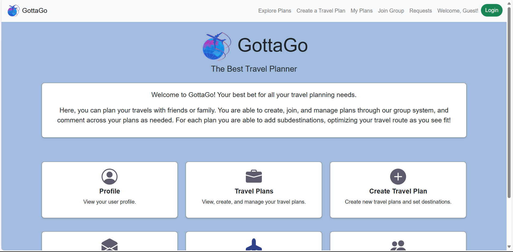

2. Click the blue login button and login with a google account 

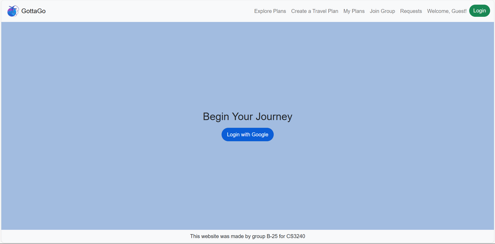

3. Navigate to the create a travel plan page

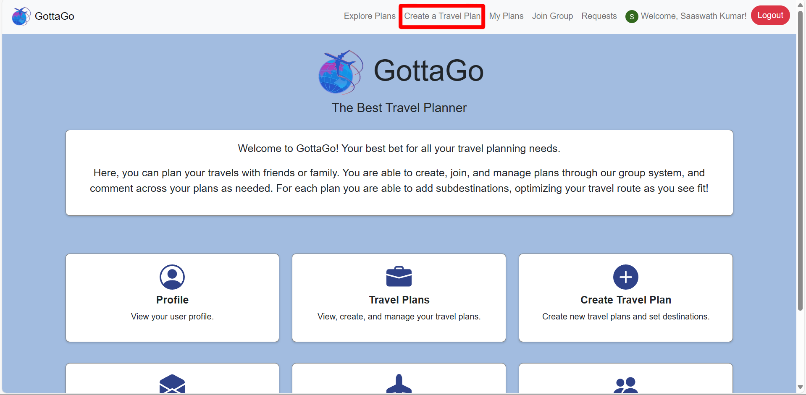

4. Fill out the form for creating a travel plan. Required items are indicated by the red star next to the item name. When you are ready to create the plan, hit the green submit button

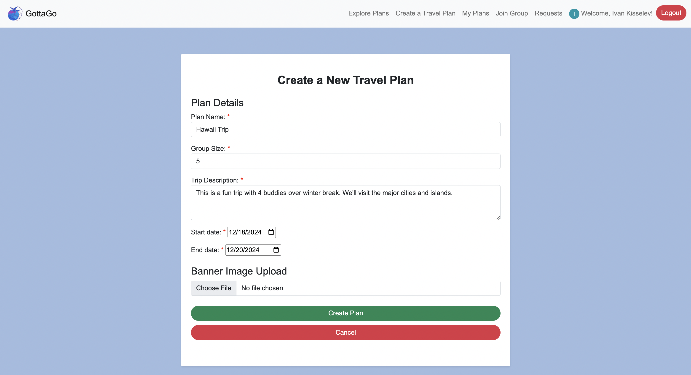

5. You should be redirected to the My Plans page. To navigate to your plan, scroll to the bottom. If your plan is on a separate page, click the next button to go onto the next page to find your plan

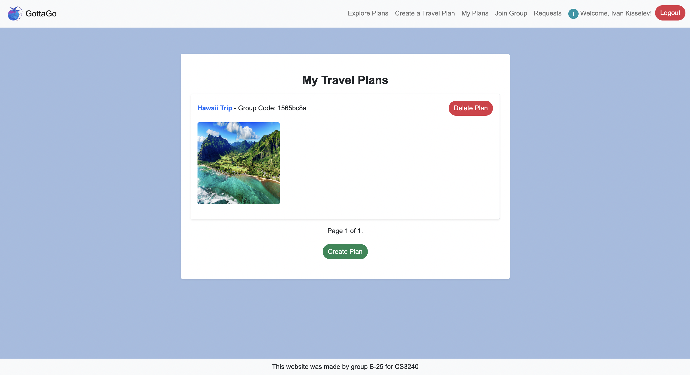

6. Within your plan, there are buttons at the top of the banner image to navigate back to your plans and to edit the plan. Beneath the banner, there is a map showing all the destination pins for your plan. If you have no destinations, the map displays New York as the default. Scrolling down beneath the map should show the budget for the plan and the destinations, which are both blank since the plan was just created

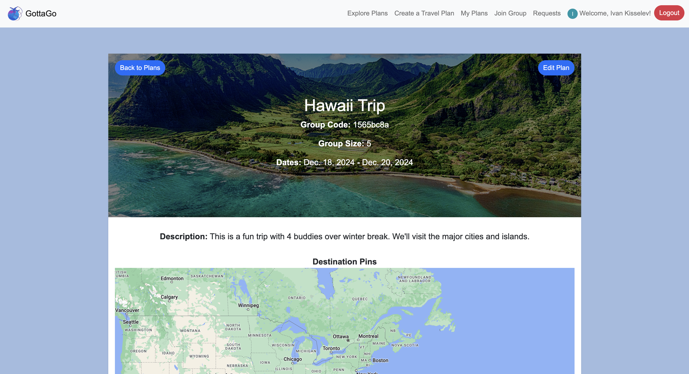

7. Click the green button to add a new destination

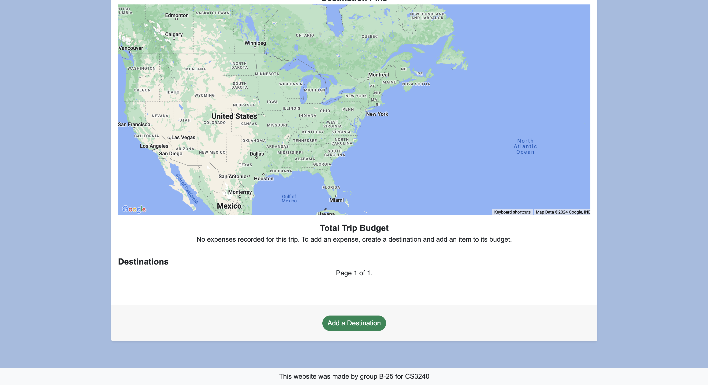

8. Fill out the destination form to add a destination for your new plan. For selecting a destination location, enter an address and click on an address that is autofilled by the search bar. When you are ready to create the destination, hit the green Save "Destination" button.

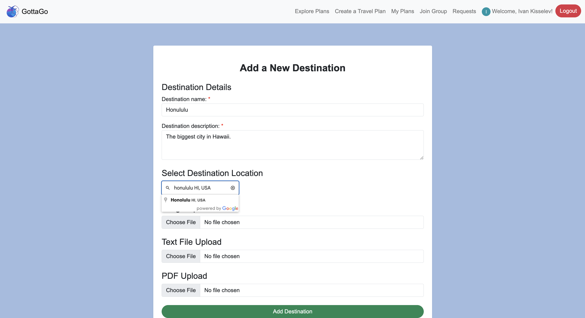

9. You should be redirected to your plan page after submitting a destination. Scroll to the bottom and you should see your destination. Click on the destination name to navigate to that destination page

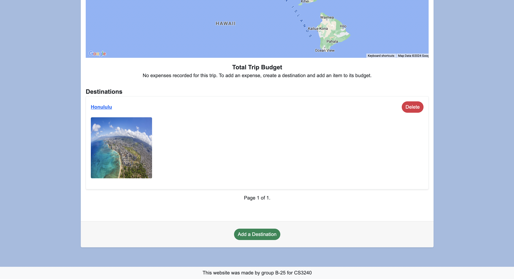

9. You will now see your destination. If you wish to update the address, enter an address, click on one of the options shown, and click the green "Update Stored Pin" button. If you wish to edit the destination, click the blue "Edit Destination" button to fill out the form to edit the destination.

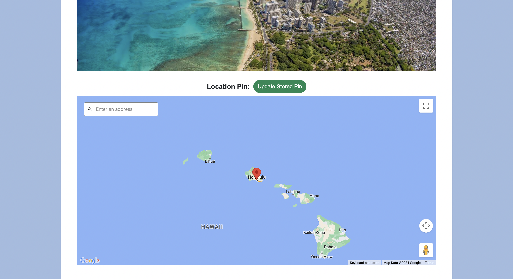

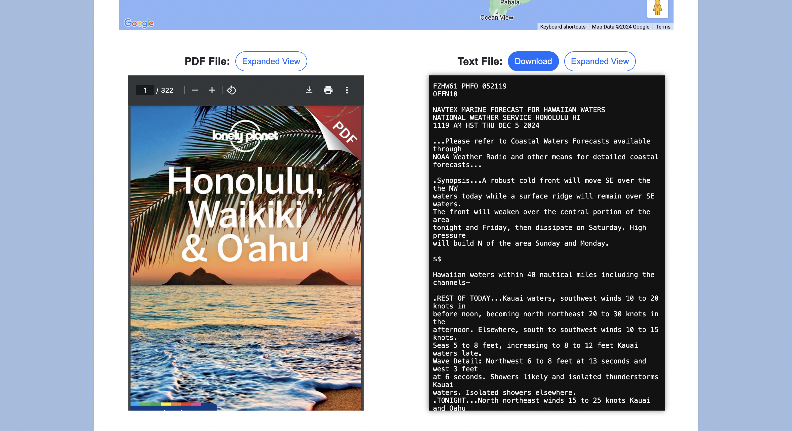

10. Underneath the map, there should be an "Expenses Summary" section. To add an expense, click the blue "Add Expenses" button. 

11. To add an expense, enter an expense name, an amount, and a date. Click the green "Add" button to add the expense. 

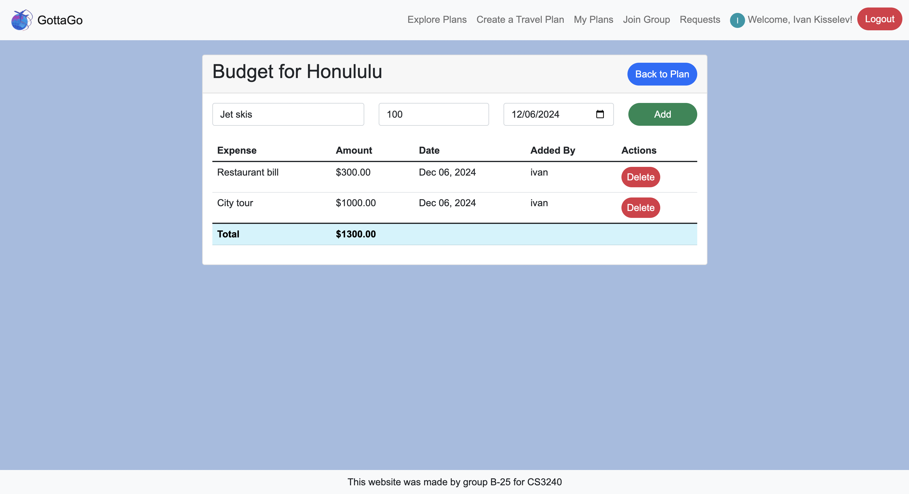

12. Navigate back to the plan page using the blue button. Beneath the map you should now see a number for the Total Trip Budget.

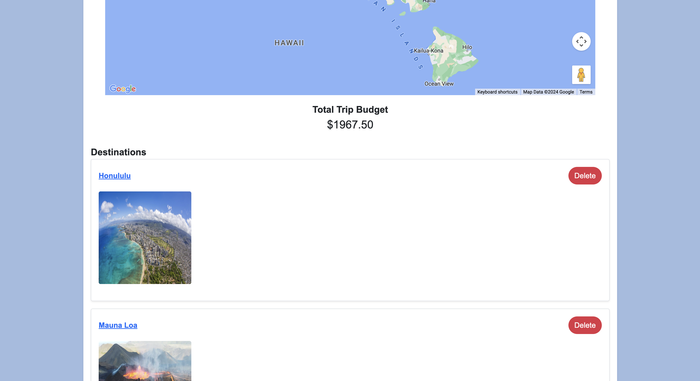

13. To add a comment to the plan, enter a comment within the comment field and hit the green "Submit Comment" button to submit your comment

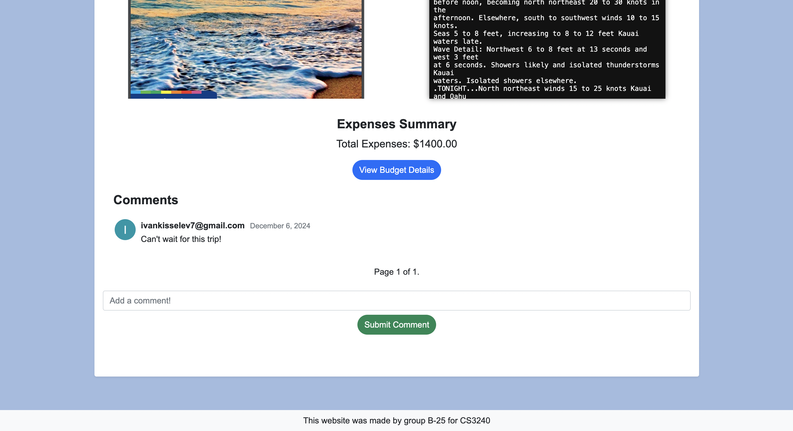

13. To delete a destination, click the red "Delete" button. 

14. Navigate back to "My Plans" by clicking the blue "Back to Plans" button. To delete a plan, click the red "Delete Plan" button.

15. To view all plans, click the "Explore Plans" button in the navigation bar. 

16. You should see a list of plans with group codes. To join a group, copy the group code and hit the "Join Group" button in the navigation bar.

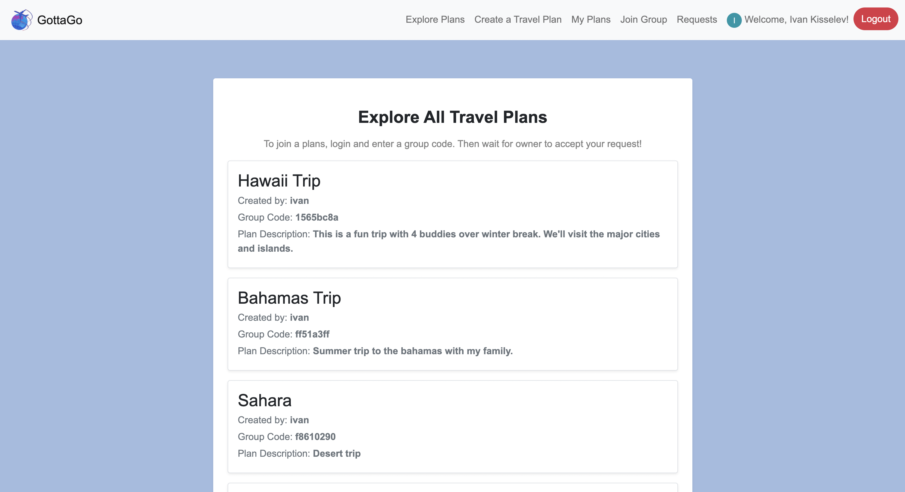

17. You should now be redirected to the "Join Group" page. Enter the code and hit the green button to send a join request.

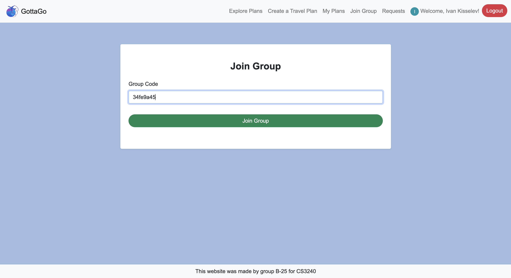
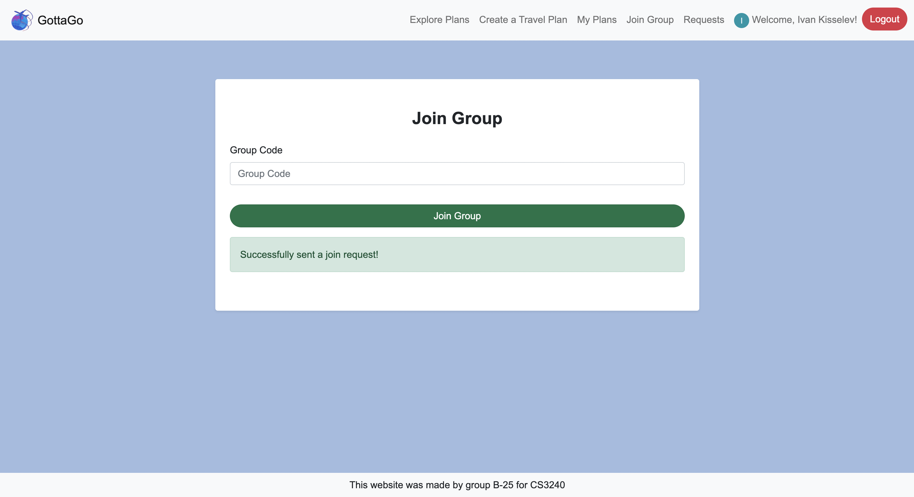

18. If you have a pending request, you should see a notification in the Navigation Bar for the "Requests" button.

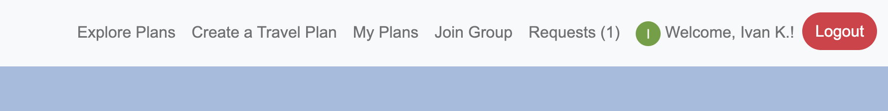

19. Click on the "Requests" button in the navigation bar. Click "accept" to accept the request to join and click "decline" to decline the request

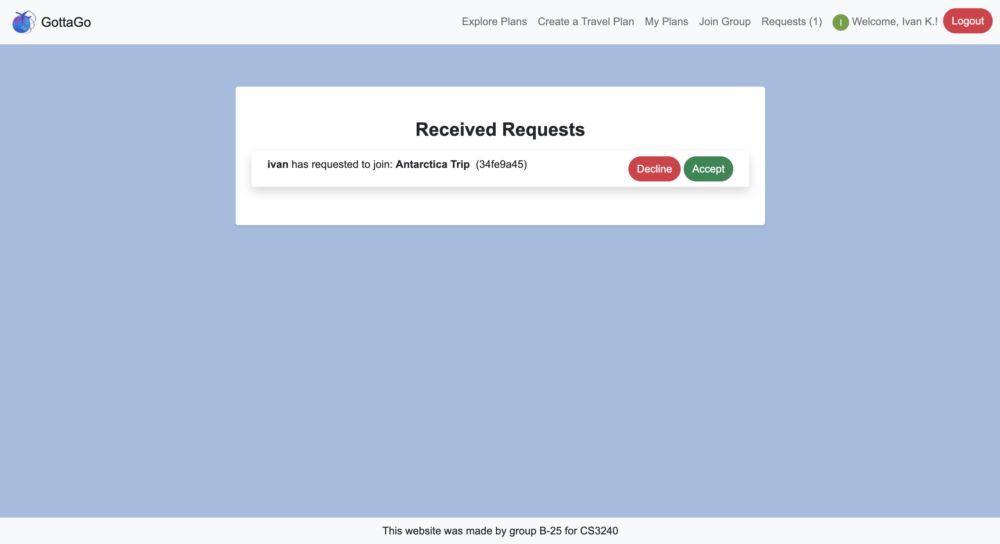

## Key Features
### Google Maps Integration
* Ivan Kisselev 
### Budgeting Tool
* Tony Tran
### Comments Section
* Saaswath Kumar
### Home Page Design
* Samay Jamakayala

## Contributors
* ### Samay Jamakayala (Scrum Master)
* ### Ivan Kisselev (Requirements Manager)
* ### Tony Tran (Testing Manager)
* ### Saaswath Kumar (DevOps Manager)

